# Master Thesis - Docker Compose Setup

This project uses Docker Compose to orchestrate multiple services for a data pipeline architecture. Below you will find the full service list, prerequisites, known issues, and setup instructions.

## Services Overview

| Service         | Image                                         | Host Ports             | Description                                    |
| --------------- | --------------------------------------------- | ---------------------- | ---------------------------------------------- |
| **Pulsar**      | `athanasiosvaris/backupimage_pulsar:version1` | `6650`, `8080`, `1883` | Apache Pulsar standalone (messaging/streaming) |
| **JobManager**  | `flink:1.17.2-scala_2.12-java11`              | `8081`                 | Apache Flink JobManager                        |
| **TaskManager** | `flink:1.17.2-scala_2.12-java11`              | —                      | Apache Flink TaskManager                       |
| **cAdvisor**    | `gcr.io/cadvisor/cadvisor:latest`             | `8079`                 | Container resource monitoring                  |
| **Prometheus**  | `prom/prometheus`                             | `9090`                 | Metrics collection and alerting                |
| **Grafana**     | `grafana/grafana-oss`                         | `3000`                 | Metrics visualization and dashboards           |
| **Mosquitto**   | `eclipse-mosquitto`                           | `1884`, `9001`         | MQTT broker                                    |
| **PostgreSQL**  | `postgres:12`                                 | `5432`                 | Relational database                            |
| **RustFS**      | `rustfs/rustfs:latest`                        | `9000`, `9002`         | S3-compatible object storage                   |

All services are connected via a custom Docker network named `pulsar-mosquitto`.

---

## Prerequisites

Before running `docker compose up`, you **must** create the required directories and configuration files on the host. Docker bind mounts expect these to exist — if they don't, Docker will create them as directories instead of files, causing containers to fail.

### 0. Configure the `.env` file

The `docker-compose.yml` uses a `HOST_HOME` variable for host volume paths, so it works on any machine. Before starting, edit the `.env` file in the project root and set `HOST_HOME` to your home directory :

```bash
whoami 
cat > .env << 'EOF'
HOST_HOME=/home/<your-username>
EOF
```


> **Note:** This is required because running `docker compose` with `sudo` resolves `~` to `/root/` instead of your user home directory.

### 1. Mosquitto (Eclipse MQTT Broker)

Mosquitto requires a config file, a password file, and log/data directories to exist **before** starting the container.

```bash
# Create directory structure
mkdir -p ~/mosquitto/config ~/mosquitto/log ~/mosquitto/data

# Create the configuration file
cat > ~/mosquitto/config/mosquitto.conf << 'EOF'
allow_anonymous false
listener 1883
listener 9001
protocol websockets
persistence true
password_file /mosquitto/config/pwfile
persistence_file mosquitto.db
persistence_location /mosquitto/data/
EOF

# Create an empty password file
touch ~/mosquitto/config/pwfile
```

> **Important:** With `allow_anonymous false` and an empty password file, no MQTT client will be able to connect. After starting the container, create a user:
> ```bash
> docker exec -it mosquittoo mosquitto_passwd -c /mosquitto/config/pwfile <username>
> ```

### 2. Prometheus

Prometheus expects a configuration file at `./apache-pulsar/prometheus/prometheus.yml` (relative to where `docker compose` is run). Make sure this file exists before starting the stack.

```bash
# Verify the file exists
ls ./apache-pulsar/prometheus/prometheus.yml
```

### 3. RustFS

RustFS mounts `/mnt/rustfs/data` from the host. Create it with proper permissions:

```bash
sudo mkdir -p /mnt/rustfs/data
```

### 4. PostgreSQL

PostgreSQL stores its data at `~/postgres`. Docker will create the directory if it doesn't exist, but it's good practice to create it explicitly:

```bash
mkdir -p ~/postgres
```

---

## Quick Start

After cloning the repo for the first time, follow these steps:

### 1. Limit Docker log size

To prevent container logs from filling your disk, create or edit `/etc/docker/daemon.json`:

```json
{
  "log-driver": "json-file",
  "log-opts": {
    "max-size": "10m",
    "max-file": "3"
  }
}
```

Then restart Docker:

```bash
sudo systemctl restart docker
```

This caps each container to 3 log files of 10MB each.

### 2. Infrastructure

Complete all prerequisite steps above, then start the Docker services:

```bash
docker compose up -d
docker compose ps          # verify all containers are running
```

### 3. Configure Pulsar MoP (MQTT on Pulsar) protocol handler

The Pulsar container includes the MoP protocol handler NAR (`pulsar-protocol-handler-mqtt-3.4.0-SNAPSHOT.nar`), but the configuration files inside the container must be updated to enable it. Copy them out, add the MoP properties, and copy them back:

```bash
# Copy config files from the container to the host
docker cp pulsar:/pulsar/conf/broker.conf ./
docker cp pulsar:/pulsar/conf/standalone.conf ./
```

Append the following lines to **both** `broker.conf` and `standalone.conf`:

```properties
# Properties for MoP protocol handler
messagingProtocols=mqtt
protocolHandlerDirectory=/pulsar
mqttListeners=mqtt://127.0.0.1:1883
advertisedAddress=127.0.0.1
```

Then copy them back and restart Pulsar:

```bash
# Copy modified config files back into the container
docker cp ./broker.conf pulsar:/pulsar/conf/broker.conf
docker cp ./standalone.conf pulsar:/pulsar/conf/standalone.conf

# Restart Pulsar to apply changes
docker restart pulsar

# Clean up local copies
rm -f broker.conf standalone.conf
```

### 4. Java / Pulsar module

Requires **JDK 17** (or newer) and **Maven**. If you don't have JDK 17:

```bash
sudo apt install openjdk-17-jdk
sudo update-alternatives --config java   # select version 17
```

Verify with `java -version`.

```bash
cd apache-pulsar
mvn clean install
cd ..
```

### 5. Java / Flink module

```bash
cd apache-flink
mvn clean install
cd target
sudo docker cp ./ApacheFlink-0.0.1-SNAPSHOT.jar taskmanager:/opt/flink
cd ../..
```

### 6. Python / Model

Requires **Python 3** and **pip**.

```bash
cd model
python3 -m venv .venv
source .venv/bin/activate
pip install -r requirements.txt
cd ..
```

### 7. Web app

Requires **Node.js** and **npm**.

```bash
cd web-app
npm install
cd ..
```
### 8. Configure mosquitto user/password

The password file **must** be generated by the Mosquitto binary running inside the container. If you create or edit the file manually on the host, the hash format may not match the version of Mosquitto in the Docker image, causing `CONNECTION_REFUSED_NOT_AUTHORIZED` errors even with correct credentials.

```bash
# Create (or overwrite) the password file and add user1 with password user1
docker exec mosquittoo mosquitto_passwd -b /mosquitto/config/pwfile user1 user1

# Restart the container so it picks up the new credentials
docker restart mosquittoo

# Confirm the password file was written
cat ~/mosquitto/config/pwfile
```

### 9. Create Pulsar topics and schemas

The Flink sink requires `FlinkTopicSinkFinal` to be a **partitioned topic** (Flink cannot auto-create partitioned topics). The `modelConsumeTopic` requires an Avro schema to be registered before producers can write to it.

```bash
# Create the partitioned topic for Flink sink
docker exec pulsar bin/pulsar-admin topics create-partitioned-topic persistent://public/default/FlinkTopicSinkFinal --partitions 1

# Upload the Avro schema for modelConsumeTopic
docker cp ./apache-pulsar/sensor-schema.json pulsar:/tmp/sensor-schema.json
docker exec pulsar bin/pulsar-admin schemas upload persistent://public/default/modelConsumeTopic --filename /tmp/sensor-schema.json
```

### 10. Run the application

```bash
docker exec -it taskmanager /bin/bash
flink run -m jobmanager:8081 ApacheFlink-0.0.1-SNAPSHOT.jar
exit
./scripts/start_app.sh    # compiles and starts the Pulsar Java processes
./scripts/stop_app.sh     # stops them
```

> **Note:** After the initial setup, `start_app.sh` handles compilation automatically. You only need to re-run `mvn clean install` if dependencies change.

---

## Data Flow Architecture

The following diagram shows the end-to-end data flow from CSV ingestion through stream processing to forecasting. Topics and protocols are annotated on each edge.

```mermaid
flowchart LR
    CSV[/"CSV File<br/>(sensor data)"/]

    subgraph MQTT ["MQTT Broker (Mosquitto :1884)"]
        MT["Topic: {device}"]
    end

    subgraph MOP ["Pulsar MOP (:1883)"]
        PT1["Topic:<br/>persistent://public/default/{device}"]
    end

    subgraph Flink ["Apache Flink (Taskmanager)"]
        FJ["SensorMqttPulsarConnector<br/>1-min Tumbling Window<br/>keyed by sensor_id"]
    end

    subgraph Pulsar ["Apache Pulsar (:6650)"]
        PT2["Topic:<br/>persistent://public/default/{device}_sink<br/>(partitioned)"]
        PT3["Topic:<br/>persistent://public/default/{device}_model_consume"]
    end

    subgraph RustFS ["RustFS (S3-compatible :9002)"]
        B1["Bucket: missingtimestamp"]
        B2["Bucket: batch"]
        OBJ["Objects:<br/>{device}/initial/{device}.keras<br/>{device}/initial/scaler.save<br/>{device}/{ts-range}-model/{device}.keras<br/>{device}/{ts-range}-model/scaler.save"]
    end

    subgraph Python ["Python Model Service"]
        PC["pulsarConsumer.py"]
        FC["Forecasting.py"]
        IT["initial_train.py"]
        RT["retrain.py"]
    end

    subgraph DB ["PostgreSQL (:5432)"]
        TBL_ACT[("Table:<br/>{device}_actualvalues")]
        TBL_FC[("Table:<br/>{device}_forecastedvalues")]
    end

    CSV -->|"read rows"| P1
    P1["MqttClientProducerFinal<br/>(Java)"] -->|"publish JSON<br/>{sensor_id, sensor_energy_value,<br/>sensor_timestamp}"| MT
    MT -->|"subscribe"| C1["MqttClientConsumerFinal<br/>(Java)"]
    C1 -->|"publish to MOP"| PT1
    PT1 -->|"source-topic<br/>sub: FlinkSub"| FJ
    FJ -->|"sink-topic"| PT2
    PT2 -->|"consume<br/>sub: test-subscriptions"| TC["TestConsumerFinal<br/>(Java)"]
    TC -->|"produce (Avro)"| PT3
    PT3 -->|"consume<br/>sub: pythonSubscription<br/>(AvroSchema)"| PC
    PC -->|"INSERT sensor data"| TBL_ACT
    PC -->|"trigger on timeout"| FC
    FC -->|"download model & scaler<br/>(boto3 S3 API)"| RustFS
    FC -->|"SELECT last 60<br/>actual values"| TBL_ACT
    FC -->|"INSERT predictions"| TBL_FC
    IT -->|"upload initial model<br/>& scaler"| RustFS
    RT -->|"SELECT last 600 rows"| TBL_ACT
    RT -->|"upload retrained model<br/>& scaler"| RustFS
```



---

## Known Issues and Troubleshooting

### Port conflict on 1883

Both Pulsar and Mosquitto use MQTT port `1883` internally. They are mapped to **different host ports** (`1883` for Pulsar, `1884` for Mosquitto), so there is no actual conflict. However, be aware of which broker you're connecting to:

- **Pulsar MQTT** — `localhost:1883`
- **Mosquitto MQTT** — `localhost:1884`
- **Mosquitto WebSockets** — `localhost:9001`

### Mosquitto fails to start

**Symptom:** Container exits immediately or restarts in a loop.

**Cause:** The bind-mounted config file (`mosquitto.conf`) or password file (`pwfile`) did not exist on the host before starting the container. Docker created them as empty directories instead of files.

**Fix:**
```bash
# Stop and remove the container
docker compose down

# Remove the incorrectly created directories
rm -rf ~/mosquitto

# Re-create everything properly (see Prerequisites section)
mkdir -p ~/mosquitto/config ~/mosquitto/log ~/mosquitto/data
cat > ~/mosquitto/config/mosquitto.conf << 'EOF'
allow_anonymous false
listener 1883
listener 9001
protocol websockets
persistence true
password_file /mosquitto/config/pwfile
persistence_file mosquitto.db
persistence_location /mosquitto/data/
EOF
touch ~/mosquitto/config/pwfile

# Start again
docker compose up -d
```

### Mosquitto MQTT client gets `CONNECTION_REFUSED_NOT_AUTHORIZED`

**Symptom:** Java (or any) MQTT client fails with `CONNECTION_REFUSED_NOT_AUTHORIZED` even though the username and password look correct.

**Cause:** The password file (`pwfile`) was created or edited on the host instead of being generated by the `mosquitto_passwd` tool **inside the container**. Different Mosquitto versions use different password hashing schemes. If the hash was produced by a different version (or manually), the broker cannot verify the credentials and rejects the connection.

**Fix:**
```bash
docker exec mosquittoo mosquitto_passwd -b /mosquitto/config/pwfile user1 user1
docker restart mosquittoo
```

### Prometheus fails to start

**Symptom:** Prometheus container exits immediately.

**Cause:** `./apache-pulsar/prometheus/prometheus.yml` does not exist.

**Fix:** Create or verify the Prometheus config file at the expected path before running `docker compose up`.

### Pulsar fails to start — corrupted BookKeeper ledgers

**Symptom:** The Pulsar container crashes on startup or keeps restarting. Logs contain errors like:

```
Bookie handle is not available -  ledger=2 - operation=Failed to read entry - entry=0
```

```
org.apache.pulsar.broker.service.BrokerServiceException$ServiceUnitNotReadyException:
  Topic creation encountered an exception by initialize topic policies service.
  topic_name=persistent://public/functions/assignments
```

```
Failed to start pulsar service.
org.apache.pulsar.broker.PulsarServerException: java.lang.RuntimeException:
  org.apache.pulsar.client.admin.PulsarAdminException$ServerSideErrorException
```

**Cause:** Pulsar's BookKeeper (the internal storage layer) has corrupted ledger data in the `pulsardata` Docker volume. This typically happens after an unclean shutdown — for example, running `docker compose down` while Pulsar was still writing, or the container being killed unexpectedly.

**Fix:** Wipe the Pulsar data volumes and restart clean:

```bash
docker compose down
docker volume rm master_thesis_pulsardata master_thesis_pulsarconf
docker compose up -d pulsar
```

Wait ~20-30 seconds for Pulsar to fully initialize, then verify:

```bash
docker logs pulsar 2>&1 | tail -5
# You should see: "messaging service is ready"
```

> **Note:** This deletes all existing Pulsar topics and messages. This is fine for a development environment.

### RustFS permission errors

**Symptom:** RustFS container logs show permission denied errors.

**Cause:** `/mnt/rustfs/data` was auto-created by Docker with root-only permissions.

**Fix:**
```bash
sudo mkdir -p /mnt/rustfs/data
sudo chmod 777 /mnt/rustfs/data
```

---

## Service Access

| Service         | URL                     |
| --------------- | ----------------------- |
| Pulsar Admin    | `http://localhost:8080` |
| Flink Dashboard | `http://localhost:8081` |
| cAdvisor        | `http://localhost:8079` |
| Prometheus      | `http://localhost:9090` |
| Grafana         | `http://localhost:3000` |
| RustFS Console  | `http://localhost:9002` |

### Default Credentials

| Service    | Username      | Password          |
| ---------- | ------------- | ----------------- |
| PostgreSQL | `postgres`    | `postgres`        |
| RustFS     | `rustfsadmin` | `rustfsadmin`     |
| Grafana    | `admin`       | `admin` (default) |
