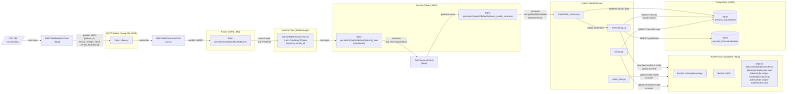

# Master Thesis — IoT Message Pipeline Architecture Comparison

## About This Work

This thesis presents a performance comparison between two different message pipeline architectures, which are two distinct implementations of the same IoT application.

The application consists of sensors that measure the power consumption of various devices, create messages recording each measurement along with the date it was received, and forward these messages to the next stage of the message pipeline for further processing. The pipeline is composed of the following stages:

- **MQTT broker (Mosquitto)** — the first stage, which connects directly to the sensors.
- **Apache Pulsar** — a distributed message-flow service.
- **Apache Flink** — a data-stream processing framework.
- **Coordination service** — receives the messages corresponding to a one-minute period and, using a Long Short-Term Memory (LSTM) neural network, predicts the power-consumption values for the next minute.
- **PostgreSQL database** — stores both the actual values and the predictions.

The neural network is stored in **RustFS**, while **cAdvisor**, **Prometheus**, and **Grafana** are used to monitor system resource usage. All of the above subsystems — except for the coordination service, which runs locally — are deployed in a Docker environment using Docker Compose.

### The Two Architectures

The main difference between the two implementations lies in the type of sensors used:

- **Architecture A** uses *"simple"* sensors that can only record measurements in real time and forward them into the system — i.e. they only support streaming data. Consequently, the need for message timing must be implemented by an external system.
- **Architecture B** uses *"smart"* sensors that can create batches of messages at specific time intervals. Here, message timing is handled by the sensors themselves.

---

## System Requirements

This project is **not self-contained** — it builds and runs directly on the host
machine and only orchestrates its backing services with Docker. Before doing
anything below, the machine **must already have** the following installed and on
`PATH`:

| Tool               | Version                                    | Used for                                                 |
| ------------------ | ------------------------------------------ | -------------------------------------------------------- |
| **Docker Engine**  | recent (tested on 29.x)                    | running the service stack                                |
| **Docker Compose** | v2 (the `docker compose` plugin)           | orchestrating the stack                                  |
| **JDK 17**         | **exactly 17** (`java-17-openjdk`)         | building **and** running the Java Pulsar & Flink modules |
| **Maven**          | 3.6+                                       | building the Java modules                                |
| **Python**         | 3 (3.10+; tested on 3.12) + `venv` + `pip` | the coordination/model service                           |
                      
| **Bash + coreutils** | —                                          | the `scripts/*.sh` runners                               |

> ⚠️ **Use JDK 17 for Maven — not a newer default JDK.** The Pulsar module
> compiles with `release 17` and `scripts/start_app.sh` hardcodes
> `/usr/lib/jvm/java-17-openjdk-amd64`, so JDK 17 is required for both build and
> run. If your system default is newer (e.g. JDK 21), Maven picks that up and the
> build fails with `error: release version 17 not supported`. Point `JAVA_HOME`
> at JDK 17 before building, in the same shell you run Maven from:
>
> ```bash
> export JAVA_HOME=/usr/lib/jvm/java-17-openjdk-amd64
> mvn -v   # the "Java version:" line must read 17
> ```
>
> (The Flink module targets Java 11 to match its `...-java11` runtime image, but
> JDK 17 compiles it fine — one JDK 17 `JAVA_HOME` builds both modules.)

This README does **not** cover installing these — set them up first (on Debian/
Ubuntu: `sudo apt install docker-ce docker-compose-plugin openjdk-17-jdk maven
python3 python3-venv nodejs npm`). Verify with `docker --version`,
`java -version` (must report 17), `mvn -v`, `python3 --version`, `node --version`.

> A scripted, fully isolated Ubuntu VM alternative (Multipass) lives in `vm/` if
> you'd rather not install these on your host.

---

## Docker Compose Setup

This project uses Docker Compose to orchestrate multiple services for a data pipeline architecture. Below you will find the full service list, prerequisites, known issues, and setup instructions.

## Services Overview

| Service         | Image                                         | Host Ports             | Description                                                                                        |
| --------------- | --------------------------------------------- | ---------------------- | -------------------------------------------------------------------------------------------------- |
| **Pulsar**      | `athanasiosvaris/backupimage_pulsar:version1` | `6650`, `8080`, `1883` | Apache Pulsar 4.0.1 standalone (messaging/streaming), with the MoP protocol handler pre-configured |
| **JobManager**  | `flink:1.17.2-scala_2.12-java11`              | `8081`                 | Apache Flink JobManager                                                                            |
| **TaskManager** | `flink:1.17.2-scala_2.12-java11`              | —                      | Apache Flink TaskManager                                                                           |
| **cAdvisor**    | `gcr.io/cadvisor/cadvisor:latest`             | `8079`                 | Container resource monitoring                                                                      |
| **Prometheus**  | `prom/prometheus`                             | `9090`                 | Metrics collection and alerting                                                                    |
| **Grafana**     | `grafana/grafana-oss`                         | `3000`                 | Metrics visualization and dashboards                                                               |
| **Mosquitto**   | `eclipse-mosquitto`                           | `1884`, `9001`         | MQTT broker                                                                                        |
| **PostgreSQL**  | `postgres:12`                                 | `5432`                 | Relational database                                                                                |
| **RustFS**      | `rustfs/rustfs:latest`                        | `9000`, `9002`         | S3-compatible object storage                                                                       |

All services are connected via a custom Docker network named `pulsar-mosquitto`.

---

## Build From Scratch

End-to-end, validated instructions to build and run the project from a fresh
checkout. For the system tools you need installed first, see
**[System Requirements](#system-requirements)** above.

> **Status:** ✅ Validated end-to-end against a clean rebuild — clone → build →
> run, with the pipeline confirmed flowing into Postgres.

### 1. Clone the repository

```bash
git clone git@github.com:Athanasiosvaris/master_thesis.git
cd master_thesis
```

A fresh clone contains everything needed to run — `grafana/`,
`apache-pulsar/prometheus/prometheus.yml`, `apache-pulsar/sensor-schema.json`,
the input CSV, and the trained models are all committed.

> **Optional — cap Docker log size.** To stop container logs filling your disk,
> create/edit `/etc/docker/daemon.json` with
> `{"log-driver":"json-file","log-opts":{"max-size":"10m","max-file":"3"}}`,
> then `sudo systemctl restart docker`. Caps each container to 3 × 10 MB logs.

### 2. Bootstrap host dirs and config

Creates `.env` (`HOST_HOME`), the Mosquitto config/dirs, and the PostgreSQL /
RustFS data dirs. Idempotent.

```bash
./scripts/bootstrap.sh
```

> ⚠️ **RustFS needs a world-writable data dir.** `/mnt/rustfs/data` must be
> `chmod 777` — the RustFS container runs as a **non-root UID** and otherwise
> dies at `docker compose up` with `[FATAL] ... Io error: Permission denied
> (os error 13)` (the container won't appear in `docker ps`; see it with
> `docker ps -a` / `docker compose logs rustfs`). `bootstrap.sh` now sets this
> automatically when it can; on a fresh machine where it needs root, run:
>
> ```bash
> sudo mkdir -p /mnt/rustfs/data && sudo chmod 777 /mnt/rustfs/data
> ```
>
> If a stale dir is carried over from a previous run, reset it:
> `sudo rm -rf /mnt/rustfs/data && sudo mkdir -p /mnt/rustfs/data && sudo chmod 777 /mnt/rustfs/data`.

### 3. Start the Docker stack

```bash
docker compose up -d
docker compose ps          # all containers should be Up
```

> **MoP (MQTT-on-Pulsar) is pre-configured.** The
> `athanasiosvaris/backupimage_pulsar:version1` image ships with the MoP protocol
> handler NAR bundled **and** enabled in `broker.conf` / `standalone.conf` —
> MQTT-on-Pulsar works out of the box, nothing to do here.

### 4. Create the Mosquitto user

Must be done by the in-container binary (host-side hashing can mismatch).

```bash
docker exec mosquittoo mosquitto_passwd -b /mosquitto/config/pwfile user1 user1
docker restart mosquittoo
```

The Java MQTT clients are hardcoded to `user1` / `user1` on Mosquitto
(`127.0.0.1:1884`) — `MqttClientConsumerFinal.java` and
`MqttClientProducerFinal.java`. The username/password here **must** match those.

> ⚠️ **Stale `~/mosquitto` pwfile → `CONNECTION_REFUSED_NOT_AUTHORIZED`.**
> `~/mosquitto` lives in `$HOME` and persists across checkouts/rebuilds. If a
> password file from an older Mosquitto version carries over, the current image
> (`eclipse-mosquitto 2.1.2`) can't validate its hash and rejects every login —
> the producer/consumer die with
> `org.fusesource.mqtt.client.MQTTException: Could not connect: CONNECTION_REFUSED_NOT_AUTHORIZED`,
> and `docker logs mosquittoo` shows `disconnected: not authorised`. **Fix:**
> regenerate the user with *this* container's binary and restart (the command
> above). For a truly clean rebuild, reset `~/mosquitto` too (not just
> `~/postgres`): `rm -rf ~/mosquitto`, then re-run `./scripts/bootstrap.sh`
> before this step. (The `world readable` / `owner is not root` lines are only
> warnings, not the cause.)

### 5. Build the Java / Pulsar module

> ⚠️ **Build with JDK 17 — not the system default.** The modules target
> `release 17`, and the runtime (`scripts/start_app.sh`) hardcodes
> `/usr/lib/jvm/java-17-openjdk-amd64`, so use JDK 17 for both build and run.
> Maven uses `JAVA_HOME` (or the default `java`); an older/mismatched JDK gives
> `error: release version 17 not supported`. Pin it explicitly:
>
> ```bash
> ls -d /usr/lib/jvm/*                                  # find your JDK 17
> # install if missing:  sudo apt install openjdk-17-jdk
> export JAVA_HOME=/usr/lib/jvm/java-17-openjdk-amd64
> mvn -v                                                # confirm "Java version: 17"
> ```
>
> Keep this `JAVA_HOME` exported for steps 5 and 6 (and whenever you run the app).

```bash
mvn -f apache-pulsar/pom.xml clean install
```

### 6. Build the Java / Flink module and deploy the jar

> ℹ️ The Flink module targets **Java 11** (`<target>11</target>`, matching the
> `flink:1.17.2-scala_2.12-java11` runtime image), **not** 17. No need to switch
> JDKs — the **JDK 17** `JAVA_HOME` from Step 5 compiles `target 11` fine and
> produces Java-11 bytecode that runs in the Flink container. Use one JDK (17)
> for both modules.

```bash
cd apache-flink
mvn clean install
cd target
sudo docker cp ./ApacheFlink-0.0.1-SNAPSHOT.jar taskmanager:/opt/flink
cd ../..
```

> ⚠️ **The `docker cp` is mandatory and not automated.** `start_app.sh` runs the
> jar by bare filename (`docker exec taskmanager flink run ... ApacheFlink-0.0.1-SNAPSHOT.jar`),
> expecting it to already live in the taskmanager container (`/opt/flink`). Unlike
> the Pulsar module — which `start_app.sh` recompiles automatically — the Flink jar
> is **never** rebuilt or redeployed by the run scripts. **Re-run this `docker cp`
> after every `apache-flink` rebuild**, otherwise the taskmanager keeps running the
> old jar (or fails if it was never copied).

### 7. Python model service

```bash
cd model
python3 -m venv .venv
source .venv/bin/activate
pip install -r requirements.txt
deactivate
cd ..
```

## Experiments

Four experiments were run to compare the two architectures — **Architecture A**
(stream-to-batch conversion with *"simple"* sensors) and **Architecture B**
(native batch processing with *"smart"* sensors). Each targets a different
dimension of the comparison.

> **Architecture A vs B is selected by the launch script.** Architecture A runs
> with **`./scripts/start_app.sh`** (stream-to-batch via Flink); Architecture B
> runs with **`./scripts/start_app_no_flink.sh`** (native batch processing, no
> Flink). Both take the same `<path-to-csv> <device-name>` arguments. This
> applies to all experiments below.

> **Start / stop the container stack (every experiment).** Bring the Docker
> services up and down between runs with **`./scripts/start_containers.sh`** and
> **`./scripts/stop_containers.sh`** (they start/stop every container in
> dependency order). For Architecture B, start without Flink:
> **`./scripts/start_containers.sh --no-flink`** (skips JobManager + TaskManager).

> **Observe results (applies to every experiment).** While an experiment runs,
> watch live resource utilization and latency in **Grafana** —
> <http://localhost:3000/login> — and inspect the trained/uploaded models in the
> **RustFS console** (`rustfs_models`) — <http://localhost:9002/rustfs/console/>.

> **Continuous retraining (every experiment).** While the pipeline runs, a **new
> LSTM model is retrained every 10 minutes for each device** — in **both**
> architectures — and re-uploaded to RustFS, so forecasts adapt to recent data.

> **Where to read the forecasting results (every experiment).** Per-device output
> is written under `logs/`: Architecture A → **`coordinator_service_deviceX.log`**,
> Architecture B → **`pulsarConsumer60Batches_deviceX.log`** (`X` = device number,
> e.g. `coordinator_service_device1.log`).

### 1. Constant-load comparison

Evaluates the two architectures under a **constant workload of 60 IoT messages
per minute**, comparing resource utilization, end-to-end latency, bottlenecks,
and the overhead introduced by the stream-to-batch conversion in Architecture A
versus the native batch processing in Architecture B.

**How to run.** Both architectures use the **same input CSV** (so the comparison
is fair):

```
/home/athanasiosvaris/notes/thesis/master_thesis/apache-pulsar/data/in_order_data/device_1_in_order_data_2025-12-08.csv
```

1. Train and upload the initial model (Build From Scratch → Step 8):

   ```bash
   cd model/train_model
   python3 initial_train.py \
       --csv_file /home/athanasiosvaris/notes/thesis/master_thesis/apache-pulsar/data/in_order_data/device_1_in_order_data_2025-12-08.csv \
       --bucket_name missingtimestamp \
       --model_name device1
   cd ../..
   ```

2. Start the pipeline — run **once per architecture**, with the same CSV:

   ```bash
   # Architecture A — stream-to-batch via Flink
   ./scripts/start_app.sh \
       /home/athanasiosvaris/notes/thesis/master_thesis/apache-pulsar/data/in_order_data/device_1_in_order_data_2025-12-08.csv \
       device1

   # Architecture B — native batch processing (no Flink)
   ./scripts/start_app_no_flink.sh \
       /home/athanasiosvaris/notes/thesis/master_thesis/apache-pulsar/data/in_order_data/device_1_in_order_data_2025-12-08.csv \
       device1
   ```

### 2. Increasing-load comparison

Evaluates the **scalability** of the two architectures by progressively
increasing the workload **from 1 to 20 IoT devices**, comparing resource
utilization, latency, message coverage, and overall performance under
continuously growing load.

**How to run.** Both architectures use the per-device CSVs in
`apache-pulsar/data/in_order_data/` — one file per device, named
`device_N_in_order_data_2025-12-08.csv` for `N = 1..20`.

1. Train and upload the initial model for **all 20 devices** (required for both
   architectures — one model per device, in the `missingtimestamp` bucket):

   ```bash
   cd model/train_model
   for n in $(seq 1 20); do
       python3 initial_train.py \
           --csv_file /home/athanasiosvaris/notes/thesis/master_thesis/apache-pulsar/data/in_order_data/device_${n}_in_order_data_2025-12-08.csv \
           --bucket_name missingtimestamp \
           --model_name device${n}
   done
   cd ../..
   ```

2. Run the scaling experiment — **once per architecture** (scales 1 → 20,
   adding one device per phase). Run from the repo root:

   ```bash
   # Architecture A — stream-to-batch via Flink
    ./scripts/run_scaling_experiment.sh ../apache-pulsar/data/in_order_data

   # Architecture B — native batch processing (no Flink)
    ./scripts/run_scaling_experiment_no_flink.sh ../apache-pulsar/data/in_order_data
   ```

### 3. Prediction accuracy evaluation

Compares the **prediction accuracy** of the two architectures by measuring the
impact of **incomplete input windows in Architecture A** against the **complete
input windows in Architecture B**, assessing how missing data affects
forecasting quality.

**How to run.** Unlike Experiment 1, each architecture uses a **different input
CSV** — that *is* the comparison: Architecture A is fed data with missing
timestamps (→ incomplete windows), Architecture B clean in-order data (→ complete
windows). Both run `device1`.

| Architecture     | Input CSV                                                                           |
| ---------------- | ----------------------------------------------------------------------------------- |
| **A** (Flink)    | `apache-pulsar/data/missing_timestamp_data/device_1_data_2025-12-08_2025-12-09.csv` |
| **B** (no Flink) | `apache-pulsar/data/in_order_data/device_1_in_order_data_2025-12-08.csv`            |

1. Train and upload the initial model for `device1` (Build From Scratch → Step 8;
   shared by both architectures):

   ```bash
   cd model/train_model
   python3 initial_train.py \
       --csv_file /home/athanasiosvaris/notes/thesis/master_thesis/apache-pulsar/data/in_order_data/device_1_in_order_data_2025-12-08.csv \
       --bucket_name missingtimestamp \
       --model_name device1
   cd ../..
   ```

2. Start the pipeline — **once per architecture**, each with its own CSV. Run
   from the repo root:

   ```bash
   # Architecture A — incomplete windows (missing timestamps), via Flink
   ./scripts/start_app.sh \
       apache-pulsar/data/missing_timestamp_data/device_1_data_2025-12-08_2025-12-09.csv \
       device1

   # Architecture B — complete windows (in-order), no Flink
   ./scripts/start_app_no_flink.sh \
       apache-pulsar/data/in_order_data/device_1_in_order_data_2025-12-08.csv \
       device1
   ```

### 4. Watermark sensitivity analysis

Investigates the impact of different **Apache Flink watermark values** on
Architecture A, evaluating their effect on batch completeness, resource
utilization, and prediction accuracy by balancing event lateness against data
completeness.

**How to run.** **Architecture A only** (watermarks are a Flink concept). You
vary the Flink watermark, rebuild, and observe the effect — repeat for each value
(e.g. 0s, 5s, 10s). Input CSV:
`apache-pulsar/data/missing_timestamp_data/device_1_data_2025-12-08_2025-12-09.csv`.

1. **Switch the watermark strategy** in
   `apache-flink/src/main/java/sensor/SensorMqttPulsarConnector.java` (lines
   77–81): comment out the monotonic-timestamps strategy and enable the
   bounded-out-of-orderness one with your chosen lateness (**0, 5 or 10 seconds**):

   ```java
   // comment this out:
   //DataStream<Sensor> Data = env.fromSource(source, WatermarkStrategy.<Sensor>forMonotonousTimestamps()
   //        .withTimestampAssigner((event, timestamp) -> event.getSensor_timestamp() * 1000L ).withIdleness(Duration.ofMinutes(1)), "Pulsar Source");

   // uncomment and set the watermark (5 or 10 seconds):
   DataStream<Sensor> Data = env.fromSource(source, WatermarkStrategy.<Sensor>forBoundedOutOfOrderness(Duration.ofSeconds(5))
           .withTimestampAssigner((event, timestamp) ->  event.getSensor_timestamp() * 1000L ) , "Pulsar Source");
   ```

2. **Rebuild Flink and redeploy the jar** (Build From Scratch → Step 6):

   ```bash
   cd apache-flink
   mvn clean install
   cd target
   sudo docker cp ./ApacheFlink-0.0.1-SNAPSHOT.jar taskmanager:/opt/flink
   cd ../..
   ```

3. **Train and upload the initial model** for `device1` (Build From Scratch →
   Step 8):

   ```bash
   cd model/train_model
   python3 initial_train.py \
       --csv_file /home/athanasiosvaris/notes/thesis/master_thesis/apache-pulsar/data/in_order_data/device_1_in_order_data_2025-12-08.csv \
       --bucket_name missingtimestamp \
       --model_name device1
   cd ../..
   ```

4. **Run the pipeline** (Architecture A), from the repo root:

   ```bash
   ./scripts/start_app.sh \
       apache-pulsar/data/missing_timestamp_data/device_1_data_2025-12-08_2025-12-09.csv \
       device1
   ```

Repeat steps 1–4 for each watermark value you want to compare (e.g. 5s vs 10s).

---

## Data Flow Architecture

The following diagram shows the end-to-end data flow from CSV ingestion through stream processing to forecasting. Topics and protocols are annotated on each edge.


```mermaid
flowchart LR
    CSV[/"CSV File<br/>(sensor data)"/]

    subgraph MQTT ["MQTT Broker (Mosquitto :1884)"]
        MT["Topic: {device}"]
    end

    subgraph MOP ["Pulsar MOP (:1883)"]
        PT1["Topic:<br/>persistent://public/default/{device}"]
    end

    subgraph Flink ["Apache Flink (Taskmanager)"]
        FJ["SensorMqttPulsarConnector<br/>1-min Tumbling Window<br/>keyed by sensor_id"]
    end

    subgraph Pulsar ["Apache Pulsar (:6650)"]
        PT2["Topic:<br/>persistent://public/default/{device}_sink<br/>(partitioned)"]
        PT3["Topic:<br/>persistent://public/default/{device}_model_consume"]
    end

    subgraph RustFS ["RustFS (S3-compatible :9002)"]
        B1["Bucket: missingtimestamp"]
        B2["Bucket: batch"]
        OBJ["Objects:<br/>{device}/initial/{device}.keras<br/>{device}/initial/scaler.save<br/>{device}/{ts-range}-model/{device}.keras<br/>{device}/{ts-range}-model/scaler.save"]
    end

    subgraph Python ["Python Model Service"]
        PC["coordinator_service.py"]
        FC["Forecasting.py"]
        IT["initial_train.py"]
        RT["retrain.py"]
    end

    subgraph DB ["PostgreSQL (:5432)"]
        TBL_ACT[("Table:<br/>{device}_actualvalues")]
        TBL_FC[("Table:<br/>{device}_forecastedvalues")]
    end

    CSV -->|"read rows"| P1
    P1["MqttClientProducerFinal<br/>(Java)"] -->|"publish JSON<br/>{sensor_id, sensor_energy_value,<br/>sensor_timestamp}"| MT
    MT -->|"subscribe"| C1["MqttClientConsumerFinal<br/>(Java)"]
    C1 -->|"publish to MOP"| PT1
    PT1 -->|"source-topic<br/>sub: FlinkSub"| FJ
    FJ -->|"sink-topic"| PT2
    PT2 -->|"consume<br/>sub: test-subscriptions"| TC["TestConsumerFinal<br/>(Java)"]
    TC -->|"produce (Avro)"| PT3
    PT3 -->|"consume<br/>sub: pythonSubscription<br/>(AvroSchema)"| PC
    PC -->|"INSERT sensor data"| TBL_ACT
    PC -->|"trigger on timeout"| FC
    FC -->|"download model & scaler<br/>(boto3 S3 API)"| RustFS
    FC -->|"SELECT last 60<br/>actual values"| TBL_ACT
    FC -->|"INSERT predictions"| TBL_FC
    IT -->|"upload initial model<br/>& scaler"| RustFS
    RT -->|"SELECT last 600 rows"| TBL_ACT
    RT -->|"upload retrained model<br/>& scaler"| RustFS
```

---

## Known Issues and Troubleshooting

### Port conflict on 1883

Both Pulsar and Mosquitto use MQTT port `1883` internally. They are mapped to **different host ports** (`1883` for Pulsar, `1884` for Mosquitto), so there is no actual conflict. However, be aware of which broker you're connecting to:

- **Pulsar MQTT** — `localhost:1883`
- **Mosquitto MQTT** — `localhost:1884`
- **Mosquitto WebSockets** — `localhost:9001`

### Mosquitto fails to start

**Symptom:** Container exits immediately or restarts in a loop.

**Cause:** The bind-mounted config file (`mosquitto.conf`) or password file (`pwfile`) did not exist on the host before starting the container. Docker created them as empty directories instead of files.

**Fix:**
```bash
# Stop and remove the container
docker compose down

# Remove the incorrectly created directories
rm -rf ~/mosquitto

# Re-create everything properly (re-run the bootstrap script)
./scripts/bootstrap.sh

# Start again
docker compose up -d
```

### Mosquitto MQTT client gets `CONNECTION_REFUSED_NOT_AUTHORIZED`

**Symptom:** Java (or any) MQTT client fails with `CONNECTION_REFUSED_NOT_AUTHORIZED` even though the username and password look correct.

**Cause:** The password file (`pwfile`) was created or edited on the host instead of being generated by the `mosquitto_passwd` tool **inside the container**, or a stale `pwfile` from a different Mosquitto version persisted in `~/mosquitto`. Different Mosquitto versions use different password hashing schemes, so a foreign hash cannot be verified and the broker rejects the connection.

**Fix:**
```bash
docker exec mosquittoo mosquitto_passwd -b /mosquitto/config/pwfile user1 user1
docker restart mosquittoo
```

### Prometheus fails to start

**Symptom:** Prometheus container exits immediately.

**Cause:** `./apache-pulsar/prometheus/prometheus.yml` does not exist.

**Fix:** Create or verify the Prometheus config file at the expected path before running `docker compose up`.

### Pulsar fails to start — corrupted BookKeeper ledgers

**Symptom:** The Pulsar container crashes on startup or keeps restarting. Logs contain errors like:

```
Bookie handle is not available -  ledger=2 - operation=Failed to read entry - entry=0
```

```
org.apache.pulsar.broker.service.BrokerServiceException$ServiceUnitNotReadyException:
  Topic creation encountered an exception by initialize topic policies service.
  topic_name=persistent://public/functions/assignments
```

```
Failed to start pulsar service.
org.apache.pulsar.broker.PulsarServerException: java.lang.RuntimeException:
  org.apache.pulsar.client.admin.PulsarAdminException$ServerSideErrorException
```

**Cause:** Pulsar's BookKeeper (the internal storage layer) has corrupted ledger data in the `pulsardata` Docker volume. This typically happens after an unclean shutdown — for example, running `docker compose down` while Pulsar was still writing, or the container being killed unexpectedly.

**Fix:** Wipe the Pulsar data volumes and restart clean:

```bash
docker compose down
docker volume rm master_thesis_pulsardata master_thesis_pulsarconf
docker compose up -d pulsar
```

Wait ~20-30 seconds for Pulsar to fully initialize, then verify:

```bash
docker logs pulsar 2>&1 | tail -5
# You should see: "messaging service is ready"
```

> **Note:** This deletes all existing Pulsar topics and messages. This is fine for a development environment.

### RustFS permission errors

**Symptom:** RustFS container logs show permission denied errors.

**Cause:** `/mnt/rustfs/data` was auto-created by Docker with root-only permissions.

**Fix:**
```bash
sudo mkdir -p /mnt/rustfs/data
sudo chmod 777 /mnt/rustfs/data
```

---

## Service Access

| Service         | URL                     |
| --------------- | ----------------------- |
| Pulsar Admin    | `http://localhost:8080` |
| Flink Dashboard | `http://localhost:8081` |
| cAdvisor        | `http://localhost:8079` |
| Prometheus      | `http://localhost:9090` |
| Grafana         | `http://localhost:3000` |
| RustFS Console  | `http://localhost:9002` |

### Default Credentials

| Service    | Username      | Password          |
| ---------- | ------------- | ----------------- |
| PostgreSQL | `postgres`    | `postgres`        |
| RustFS     | `rustfsadmin` | `rustfsadmin`     |
| Grafana    | `admin`       | `admin` (default) |
